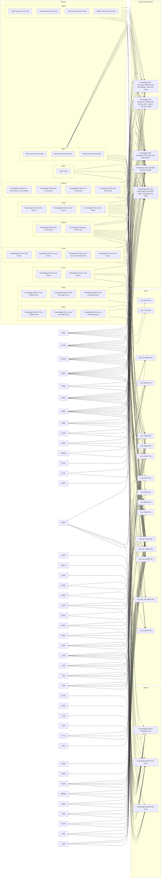
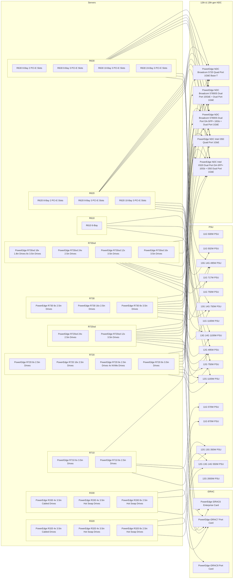

# Dell Device Types Flow Chart

## All

```mermaid
flowchart LR
    subgraph Servers
        subgraph R320
            PowerEdge_R320_4x_3.5in_Cabled_Drives[PowerEdge R320 4x 3.5in Cabled Drives]
            PowerEdge_R320_4x_3.5in_Hot_Swap_Drives[PowerEdge R320 4x 3.5in Hot Swap Drives]
            PowerEdge_R320_8x_2.5in_Hot_Swap_Drives[PowerEdge R320 8x 2.5in Hot Swap Drives]
        end
        subgraph R330
            PowerEdge_R330_4x_3.5in_Cabled_Drives[PowerEdge R330 4x 3.5in Cabled Drives]
            PowerEdge_R330_4x_3.5in_Hot_Swap_Drives[PowerEdge R330 4x 3.5in Hot Swap Drives]
            PowerEdge_R330_8x_2.5in_Hot_Swap_Drives[PowerEdge R330 8x 2.5in Hot Swap Drives]
        end
        subgraph R710
            PowerEdge_R710_6x_3.5in_Drives[PowerEdge R710 6x 3.5in Drives]
            PowerEdge_R710_8x_2.5in_Drives[PowerEdge R710 8x 2.5in Drives]
        end
        subgraph R720
            PowerEdge_R720_8x_2.5in_Drives[PowerEdge R720 8x 2.5in Drives]
            PowerEdge_R720_16x_2.5in_Drives[PowerEdge R720 16x 2.5in Drives]
            PowerEdge_R720_8x_2.5in_Drives_4x_NVMe_Drives[PowerEdge R720 8x 2.5in Drives 4x NVMe Drives]
            PowerEdge_R720_8x_3.5in_Drives[PowerEdge R720 8x 3.5in Drives]
        end
        subgraph R720xd
            PowerEdge_R720xd_24x_2.5in_Drives[PowerEdge R720xd 24x 2.5in Drives]
            PowerEdge_R720xd_12x_3.5in_Drives[PowerEdge R720xd 12x 3.5in Drives]
        end
        subgraph R730
            PowerEdge_R730_8x_2.5in_Drives[PowerEdge R730 8x 2.5in Drives]
            PowerEdge_R730_16x_2.5in_Drives[PowerEdge R730 16x 2.5in Drives]
            PowerEdge_R730_8x_3.5in_Drives[PowerEdge R730 8x 3.5in Drives]
        end
        subgraph R730xd
            PowerEdge_R730xd_18x_1.8in_Drives_8x_3.5in_Drives[PowerEdge R730xd 18x 1.8in Drives 8x 3.5in Drives]
            PowerEdge_R730xd_24x_2.5in_Drives[PowerEdge R730xd 24x 2.5in Drives]
            PowerEdge_R730xd_12x_3.5in_Drives[PowerEdge R730xd 12x 3.5in Drives]
            PowerEdge_R730xd_16x_3.5in_Drives[PowerEdge R730xd 16x 3.5in Drives]
        end
        subgraph R610
            R610_6-Bay[R610 6-Bay]
        end
        subgraph R620
            R620_8-Bay_2-PCI[R620 8-Bay 2 PCI-E Slots]
            R620_8-Bay_3-PCI[R620 8-Bay 3 PCI-E Slots]
            R620_10-Bay_3-PCI[R620 10-Bay 3 PCI-E Slots]
        end
        subgraph R630
            R630_8-Bay_2-PCI[R630 8-Bay 2 PCI-E Slots]
            R630_8-Bay_3-PCI[R630 8-Bay 3 PCI-E Slots]
            R630_10-Bay_3-PCI[R630 10-Bay 3 PCI-E Slots]
            R630_24-Bay_3-PCI[R630 24-Bay 3 PCI-E Slots]
        end
    end
    subgraph PSU
        11G-500W-PSU[11G 500W PSU]
        11G-502W-PSU[11G 502W PSU]
        11G-570W-PSU[11G 570W PSU]
        11G-717W-PSU[11G 717W PSU]
        11G-750W-PSU[11G 750W PSU]
        11G-870W-PSU[11G 870W PSU]
        11G-1100W-PSU[11G 1100W PSU]
        12G-13G-350W-PSU[12G 13G 350W PSU]
        12G-13G-14G-550W-PSU[12G 13G 14G 550W PSU]
        12G-495W-PSU[12G 495W PSU]
        12G-750W-PSU[12G 750W PSU]
        12G-1100W-PSU[12G 1100W PSU]
        13G-14G-495W-PSU[13G 14G 495W PSU]
        13G-14G-750W-PSU[13G 14G 750W PSU]
        13G-14G-1100W-PSU[13G 14G 1100W PSU]
        14G-2000W-PSU[12G 2000W PSU]
    end
    subgraph iDRAC
        PowerEdge_iDRAC6_Enterprise_Card[PowerEdge iDRAC6 Enterprise Card]
        PowerEdge_iDRAC7_Port_Card[PowerEdge iDRAC7 Port Card]
        PowerEdge_iDRAC8_Port_Card[PowerEdge iDRAC8 Port Card]
    end
    subgraph 12G-13G-NDC[12th & 13th gen NDC]
        PowerEdge_NDC_Broadcom_5720_Quad_Port_1GbE_Base-T[PowerEdge NDC Broadcom 5720 Quad Port 1GbE Base-T]
        PowerEdge_NDC_Broadcom_57800S_Dual_Port_10GbE_+_Dual_Port_1GbE[PowerEdge NDC Broadcom 57800S Dual Port 10GbE + Dual Port 1GbE]
        PowerEdge_NDC_Broadcom_57800S_Dual_Port_DA-SFP+_10Gb_+_Dual_Port_1GbE[PowerEdge NDC Broadcom 57800S Dual Port DA-SFP+ 10Gb + Dual Port 1GbE]
        PowerEdge_NDC_Intel_I350_Quad_Port_1GbE[PowerEdge NDC Intel I350 Quad Port 1GbE]
        PowerEdge_NDC_Intel_X520_Dual_Port_DA-SFP+_10Gb_+_I350_Dual_Port_1GbE[PowerEdge NDC Intel X520 Dual Port DA-SFP+ 10Gb + I350 Dual Port 1GbE]
    end

    R620-->PowerEdge_NDC_Broadcom_5720_Quad_Port_1GbE_Base-T
    R630-->PowerEdge_NDC_Broadcom_5720_Quad_Port_1GbE_Base-T
    R640-->PowerEdge_NDC_Broadcom_5720_Quad_Port_1GbE_Base-T
    R720-->PowerEdge_NDC_Broadcom_5720_Quad_Port_1GbE_Base-T
    R720xd-->PowerEdge_NDC_Broadcom_5720_Quad_Port_1GbE_Base-T
    R730-->PowerEdge_NDC_Broadcom_5720_Quad_Port_1GbE_Base-T
    R730xd-->PowerEdge_NDC_Broadcom_5720_Quad_Port_1GbE_Base-T
    R740-->PowerEdge_NDC_Broadcom_5720_Quad_Port_1GbE_Base-T
    R740xd-->PowerEdge_NDC_Broadcom_5720_Quad_Port_1GbE_Base-T
    R820-->PowerEdge_NDC_Broadcom_5720_Quad_Port_1GbE_Base-T
    R830-->PowerEdge_NDC_Broadcom_5720_Quad_Port_1GbE_Base-T
    R920-->PowerEdge_NDC_Broadcom_5720_Quad_Port_1GbE_Base-T
    R930-->PowerEdge_NDC_Broadcom_5720_Quad_Port_1GbE_Base-T
    R940-->PowerEdge_NDC_Broadcom_5720_Quad_Port_1GbE_Base-T
    R620-->PowerEdge_NDC_Broadcom_57800S_Dual_Port_10GbE_+_Dual_Port_1GbE
    R630-->PowerEdge_NDC_Broadcom_57800S_Dual_Port_10GbE_+_Dual_Port_1GbE
    R720-->PowerEdge_NDC_Broadcom_57800S_Dual_Port_10GbE_+_Dual_Port_1GbE
    R720xd-->PowerEdge_NDC_Broadcom_57800S_Dual_Port_10GbE_+_Dual_Port_1GbE
    R730-->PowerEdge_NDC_Broadcom_57800S_Dual_Port_10GbE_+_Dual_Port_1GbE
    R730xd-->PowerEdge_NDC_Broadcom_57800S_Dual_Port_10GbE_+_Dual_Port_1GbE
    R820-->PowerEdge_NDC_Broadcom_57800S_Dual_Port_10GbE_+_Dual_Port_1GbE
    R920-->PowerEdge_NDC_Broadcom_57800S_Dual_Port_10GbE_+_Dual_Port_1GbE
    R930-->PowerEdge_NDC_Broadcom_57800S_Dual_Port_10GbE_+_Dual_Port_1GbE
    R620-->PowerEdge_NDC_Broadcom_57800S_Dual_Port_DA-SFP+_10Gb_+_Dual_Port_1GbE
    R630-->PowerEdge_NDC_Broadcom_57800S_Dual_Port_DA-SFP+_10Gb_+_Dual_Port_1GbE
    R720-->PowerEdge_NDC_Broadcom_57800S_Dual_Port_DA-SFP+_10Gb_+_Dual_Port_1GbE
    R720xd-->PowerEdge_NDC_Broadcom_57800S_Dual_Port_DA-SFP+_10Gb_+_Dual_Port_1GbE
    R730-->PowerEdge_NDC_Broadcom_57800S_Dual_Port_DA-SFP+_10Gb_+_Dual_Port_1GbE
    R730xd-->PowerEdge_NDC_Broadcom_57800S_Dual_Port_DA-SFP+_10Gb_+_Dual_Port_1GbE
    R820-->PowerEdge_NDC_Broadcom_57800S_Dual_Port_DA-SFP+_10Gb_+_Dual_Port_1GbE
    R920-->PowerEdge_NDC_Broadcom_57800S_Dual_Port_DA-SFP+_10Gb_+_Dual_Port_1GbE
    R930-->PowerEdge_NDC_Broadcom_57800S_Dual_Port_DA-SFP+_10Gb_+_Dual_Port_1GbE
    R620-->PowerEdge_NDC_Intel_I350_Quad_Port_1GbE
    R630-->PowerEdge_NDC_Intel_I350_Quad_Port_1GbE
    R640-->PowerEdge_NDC_Intel_I350_Quad_Port_1GbE
    R720-->PowerEdge_NDC_Intel_I350_Quad_Port_1GbE
    R720xd-->PowerEdge_NDC_Intel_I350_Quad_Port_1GbE
    R730-->PowerEdge_NDC_Intel_I350_Quad_Port_1GbE
    R730xd-->PowerEdge_NDC_Intel_I350_Quad_Port_1GbE
    R740-->PowerEdge_NDC_Intel_I350_Quad_Port_1GbE
    R740xd-->PowerEdge_NDC_Intel_I350_Quad_Port_1GbE
    R7425-->PowerEdge_NDC_Intel_I350_Quad_Port_1GbE
    R820-->PowerEdge_NDC_Intel_I350_Quad_Port_1GbE
    R840-->PowerEdge_NDC_Intel_I350_Quad_Port_1GbE
    R920-->PowerEdge_NDC_Intel_I350_Quad_Port_1GbE
    R930-->PowerEdge_NDC_Intel_I350_Quad_Port_1GbE
    R940-->PowerEdge_NDC_Intel_I350_Quad_Port_1GbE
    R940xa-->PowerEdge_NDC_Intel_I350_Quad_Port_1GbE
    M710-->PowerEdge_NDC_Intel_X520_Dual_Port_DA-SFP+_10Gb_+_I350_Dual_Port_1GbE
    R620-->PowerEdge_NDC_Intel_X520_Dual_Port_DA-SFP+_10Gb_+_I350_Dual_Port_1GbE
    R630-->PowerEdge_NDC_Intel_X520_Dual_Port_DA-SFP+_10Gb_+_I350_Dual_Port_1GbE
    R640-->PowerEdge_NDC_Intel_X520_Dual_Port_DA-SFP+_10Gb_+_I350_Dual_Port_1GbE
    R710-->PowerEdge_NDC_Intel_X520_Dual_Port_DA-SFP+_10Gb_+_I350_Dual_Port_1GbE
    R715-->PowerEdge_NDC_Intel_X520_Dual_Port_DA-SFP+_10Gb_+_I350_Dual_Port_1GbE
    R720-->PowerEdge_NDC_Intel_X520_Dual_Port_DA-SFP+_10Gb_+_I350_Dual_Port_1GbE
    R720xd-->PowerEdge_NDC_Intel_X520_Dual_Port_DA-SFP+_10Gb_+_I350_Dual_Port_1GbE
    R730-->PowerEdge_NDC_Intel_X520_Dual_Port_DA-SFP+_10Gb_+_I350_Dual_Port_1GbE
    R730xd-->PowerEdge_NDC_Intel_X520_Dual_Port_DA-SFP+_10Gb_+_I350_Dual_Port_1GbE
    R740-->PowerEdge_NDC_Intel_X520_Dual_Port_DA-SFP+_10Gb_+_I350_Dual_Port_1GbE
    R740xd-->PowerEdge_NDC_Intel_X520_Dual_Port_DA-SFP+_10Gb_+_I350_Dual_Port_1GbE
    R7425-->PowerEdge_NDC_Intel_X520_Dual_Port_DA-SFP+_10Gb_+_I350_Dual_Port_1GbE
    R815-->PowerEdge_NDC_Intel_X520_Dual_Port_DA-SFP+_10Gb_+_I350_Dual_Port_1GbE
    R820-->PowerEdge_NDC_Intel_X520_Dual_Port_DA-SFP+_10Gb_+_I350_Dual_Port_1GbE
    R840-->PowerEdge_NDC_Intel_X520_Dual_Port_DA-SFP+_10Gb_+_I350_Dual_Port_1GbE
    R910-->PowerEdge_NDC_Intel_X520_Dual_Port_DA-SFP+_10Gb_+_I350_Dual_Port_1GbE
    R920-->PowerEdge_NDC_Intel_X520_Dual_Port_DA-SFP+_10Gb_+_I350_Dual_Port_1GbE
    R930-->PowerEdge_NDC_Intel_X520_Dual_Port_DA-SFP+_10Gb_+_I350_Dual_Port_1GbE
    R940-->PowerEdge_NDC_Intel_X520_Dual_Port_DA-SFP+_10Gb_+_I350_Dual_Port_1GbE
    R940xa-->PowerEdge_NDC_Intel_X520_Dual_Port_DA-SFP+_10Gb_+_I350_Dual_Port_1GbE

    R210-->PowerEdge_iDRAC6_Enterprise_Card
    R210-II-->PowerEdge_iDRAC6_Enterprise_Card
    R310-->PowerEdge_iDRAC6_Enterprise_Card
    R410-->PowerEdge_iDRAC6_Enterprise_Card
    R415-->PowerEdge_iDRAC6_Enterprise_Card
    R510-->PowerEdge_iDRAC6_Enterprise_Card
    R515-->PowerEdge_iDRAC6_Enterprise_Card
    R610-->PowerEdge_iDRAC6_Enterprise_Card
    R710-->PowerEdge_iDRAC6_Enterprise_Card
    R810-->PowerEdge_iDRAC6_Enterprise_Card
    R910-->PowerEdge_iDRAC6_Enterprise_Card
    R320-->PowerEdge_iDRAC7_Port_Card
    R420-->PowerEdge_iDRAC7_Port_Card
    R520-->PowerEdge_iDRAC7_Port_Card
    R620-->PowerEdge_iDRAC7_Port_Card
    R720-->PowerEdge_iDRAC7_Port_Card
    T330-->PowerEdge_iDRAC7_Port_Card
    R720xd-->PowerEdge_iDRAC7_Port_Card
    R820-->PowerEdge_iDRAC7_Port_Card
    T320-->PowerEdge_iDRAC7_Port_Card
    T420-->PowerEdge_iDRAC7_Port_Card
    T620-->PowerEdge_iDRAC7_Port_Card
    R130-->PowerEdge_iDRAC8_Port_Card
    R230-->PowerEdge_iDRAC8_Port_Card
    R330-->PowerEdge_iDRAC8_Port_Card
    T130-->PowerEdge_iDRAC8_Port_Card
    T230-->PowerEdge_iDRAC8_Port_Card
    T330-->PowerEdge_iDRAC8_Port_Card

    R410-->11G-500W-PSU
    R415-->11G-500W-PSU
    R610-->11G-502W-PSU
    R710-->11G-570W-PSU
    T710-->11G-570W-PSU
    R610-->11G-717W-PSU
    R510-->11G-750W-PSU
    R515-->11G-750W-PSU
    R715-->11G-750W-PSU
    R810-->11G-750W-PSU
    R910-->11G-750W-PSU
    T710-->11G-750W-PSU
    R710-->11G-870W-PSU
    T610-->11G-870W-PSU
    R510-->11G-1100W-PSU
    R810-->11G-1100W-PSU
    R910-->11G-1100W-PSU
    T710-->11G-1100W-PSU
    R320-->12G-13G-350W-PSU
    R330-->12G-13G-350W-PSU
    R420-->12G-13G-350W-PSU
    R320-->12G-13G-14G-550W-PSU
    R330-->12G-13G-14G-550W-PSU
    R420-->12G-13G-14G-550W-PSU
    R430-->12G-13G-14G-550W-PSU
    R440-->12G-13G-14G-550W-PSU
    R530-->12G-13G-14G-550W-PSU
    R520-->12G-495W-PSU
    R620-->12G-495W-PSU
    R720-->12G-495W-PSU
    R720xd-->12G-495W-PSU
    T320-->12G-495W-PSU
    T420-->12G-495W-PSU
    T620-->12G-495W-PSU
    R520-->12G-750W-PSU
    R620-->12G-750W-PSU
    R720-->12G-750W-PSU
    R720xd-->12G-750W-PSU
    R820-->12G-750W-PSU
    R920-->12G-750W-PSU
    T320-->12G-750W-PSU
    T420-->12G-750W-PSU
    T620-->12G-750W-PSU
    R520-->12G-1100W-PSU
    R620-->12G-1100W-PSU
    R720-->12G-1100W-PSU
    R720xd-->12G-1100W-PSU
    R820-->12G-1100W-PSU
    R920-->12G-1100W-PSU
    T320-->12G-1100W-PSU
    T420-->12G-1100W-PSU
    T620-->12G-1100W-PSU
    R530-->13G-14G-495W-PSU
    R530xd-->13G-14G-495W-PSU
    R540-->13G-14G-495W-PSU
    R630-->13G-14G-495W-PSU
    R640-->13G-14G-495W-PSU
    R730-->13G-14G-495W-PSU
    R730xd-->13G-14G-495W-PSU
    R740-->13G-14G-495W-PSU
    R740xd-->13G-14G-495W-PSU
    T330-->13G-14G-495W-PSU
    T430-->13G-14G-495W-PSU
    T440-->13G-14G-495W-PSU
    T630-->13G-14G-495W-PSU
    T640-->13G-14G-495W-PSU
    R530-->13G-14G-750W-PSU
    R530xd-->13G-14G-750W-PSU
    R540-->13G-14G-750W-PSU
    R630-->13G-14G-750W-PSU
    R640-->13G-14G-750W-PSU
    R730-->13G-14G-750W-PSU
    R730xd-->13G-14G-750W-PSU
    R740-->13G-14G-750W-PSU
    R740xd-->13G-14G-750W-PSU
    R830-->13G-14G-750W-PSU
    R930-->13G-14G-750W-PSU
    T330-->13G-14G-750W-PSU
    T430-->13G-14G-750W-PSU
    T440-->13G-14G-750W-PSU
    T630-->13G-14G-750W-PSU
    T640-->13G-14G-750W-PSU
    R530-->13G-14G-1100W-PSU
    R530xd-->13G-14G-1100W-PSU
    R540-->13G-14G-1100W-PSU
    R630-->13G-14G-1100W-PSU
    R640-->13G-14G-1100W-PSU
    R730-->13G-14G-1100W-PSU
    R730xd-->13G-14G-1100W-PSU
    R740-->13G-14G-1100W-PSU
    R740xd-->13G-14G-1100W-PSU
    R830-->13G-14G-1100W-PSU
    R930-->13G-14G-1100W-PSU
    T330-->13G-14G-1100W-PSU
    T430-->13G-14G-1100W-PSU
    T440-->13G-14G-1100W-PSU
    T630-->13G-14G-1100W-PSU
    T640-->13G-14G-1100W-PSU
    R740-->14G-2000W-PSU
    R740xd-->14G-2000W-PSU
    R7425-->14G-2000W-PSU
    R840-->14G-2000W-PSU
    R940-->14G-2000W-PSU
```

## All Min

```mermaid
flowchart LR
    subgraph Servers
        subgraph R320
            PowerEdge_R320_4x_3.5in_Cabled_Drives[PowerEdge R320 4x 3.5in Cabled Drives]
            PowerEdge_R320_4x_3.5in_Hot_Swap_Drives[PowerEdge R320 4x 3.5in Hot Swap Drives]
            PowerEdge_R320_8x_2.5in_Hot_Swap_Drives[PowerEdge R320 8x 2.5in Hot Swap Drives]
        end
        subgraph R330
            PowerEdge_R330_4x_3.5in_Cabled_Drives[PowerEdge R330 4x 3.5in Cabled Drives]
            PowerEdge_R330_4x_3.5in_Hot_Swap_Drives[PowerEdge R330 4x 3.5in Hot Swap Drives]
            PowerEdge_R330_8x_2.5in_Hot_Swap_Drives[PowerEdge R330 8x 2.5in Hot Swap Drives]
        end
        subgraph R710
            PowerEdge_R710_6x_3.5in_Drives[PowerEdge R710 6x 3.5in Drives]
            PowerEdge_R710_8x_2.5in_Drives[PowerEdge R710 8x 2.5in Drives]
        end
        subgraph R720
            PowerEdge_R720_8x_2.5in_Drives[PowerEdge R720 8x 2.5in Drives]
            PowerEdge_R720_16x_2.5in_Drives[PowerEdge R720 16x 2.5in Drives]
            PowerEdge_R720_8x_2.5in_Drives_4x_NVMe_Drives[PowerEdge R720 8x 2.5in Drives 4x NVMe Drives]
            PowerEdge_R720_8x_3.5in_Drives[PowerEdge R720 8x 3.5in Drives]
        end
        subgraph R720xd
            PowerEdge_R720xd_24x_2.5in_Drives[PowerEdge R720xd 24x 2.5in Drives]
            PowerEdge_R720xd_12x_3.5in_Drives[PowerEdge R720xd 12x 3.5in Drives]
        end
        subgraph R730
            PowerEdge_R730_8x_2.5in_Drives[PowerEdge R730 8x 2.5in Drives]
            PowerEdge_R730_16x_2.5in_Drives[PowerEdge R730 16x 2.5in Drives]
            PowerEdge_R730_8x_3.5in_Drives[PowerEdge R730 8x 3.5in Drives]
        end
        subgraph R730xd
            PowerEdge_R730xd_18x_1.8in_Drives_8x_3.5in_Drives[PowerEdge R730xd 18x 1.8in Drives 8x 3.5in Drives]
            PowerEdge_R730xd_24x_2.5in_Drives[PowerEdge R730xd 24x 2.5in Drives]
            PowerEdge_R730xd_12x_3.5in_Drives[PowerEdge R730xd 12x 3.5in Drives]
            PowerEdge_R730xd_16x_3.5in_Drives[PowerEdge R730xd 16x 3.5in Drives]
        end
        subgraph R610
            R610_6-Bay[R610 6-Bay]
        end
        subgraph R620
            R620_8-Bay_2-PCI[R620 8-Bay 2 PCI-E Slots]
            R620_8-Bay_3-PCI[R620 8-Bay 3 PCI-E Slots]
            R620_10-Bay_3-PCI[R620 10-Bay 3 PCI-E Slots]
        end
        subgraph R630
            R630_8-Bay_2-PCI[R630 8-Bay 2 PCI-E Slots]
            R630_8-Bay_3-PCI[R630 8-Bay 3 PCI-E Slots]
            R630_10-Bay_3-PCI[R630 10-Bay 3 PCI-E Slots]
            R630_24-Bay_3-PCI[R630 24-Bay 3 PCI-E Slots]
        end
    end
    subgraph PSU
        11G-500W-PSU[11G 500W PSU]
        11G-502W-PSU[11G 502W PSU]
        11G-570W-PSU[11G 570W PSU]
        11G-717W-PSU[11G 717W PSU]
        11G-750W-PSU[11G 750W PSU]
        11G-870W-PSU[11G 870W PSU]
        11G-1100W-PSU[11G 1100W PSU]
        12G-13G-350W-PSU[12G 13G 350W PSU]
        12G-13G-14G-550W-PSU[12G 13G 14G 550W PSU]
        12G-495W-PSU[12G 495W PSU]
        12G-750W-PSU[12G 750W PSU]
        12G-1100W-PSU[12G 1100W PSU]
        13G-14G-495W-PSU[13G 14G 495W PSU]
        13G-14G-750W-PSU[13G 14G 750W PSU]
        13G-14G-1100W-PSU[13G 14G 1100W PSU]
        14G-2000W-PSU[12G 2000W PSU]
    end
    subgraph iDRAC
        PowerEdge_iDRAC6_Enterprise_Card[PowerEdge iDRAC6 Enterprise Card]
        PowerEdge_iDRAC7_Port_Card[PowerEdge iDRAC7 Port Card]
        PowerEdge_iDRAC8_Port_Card[PowerEdge iDRAC8 Port Card]
    end
    subgraph 12G-13G-NDC[12th & 13th gen NDC]
        PowerEdge_NDC_Broadcom_5720_Quad_Port_1GbE_Base-T[PowerEdge NDC Broadcom 5720 Quad Port 1GbE Base-T]
        PowerEdge_NDC_Broadcom_57800S_Dual_Port_10GbE_+_Dual_Port_1GbE[PowerEdge NDC Broadcom 57800S Dual Port 10GbE + Dual Port 1GbE]
        PowerEdge_NDC_Broadcom_57800S_Dual_Port_DA-SFP+_10Gb_+_Dual_Port_1GbE[PowerEdge NDC Broadcom 57800S Dual Port DA-SFP+ 10Gb + Dual Port 1GbE]
        PowerEdge_NDC_Intel_I350_Quad_Port_1GbE[PowerEdge NDC Intel I350 Quad Port 1GbE]
        PowerEdge_NDC_Intel_X520_Dual_Port_DA-SFP+_10Gb_+_I350_Dual_Port_1GbE[PowerEdge NDC Intel X520 Dual Port DA-SFP+ 10Gb + I350 Dual Port 1GbE]
    end

    R620-->PowerEdge_NDC_Broadcom_5720_Quad_Port_1GbE_Base-T
    R630-->PowerEdge_NDC_Broadcom_5720_Quad_Port_1GbE_Base-T
    R720-->PowerEdge_NDC_Broadcom_5720_Quad_Port_1GbE_Base-T
    R720xd-->PowerEdge_NDC_Broadcom_5720_Quad_Port_1GbE_Base-T
    R730-->PowerEdge_NDC_Broadcom_5720_Quad_Port_1GbE_Base-T
    R730xd-->PowerEdge_NDC_Broadcom_5720_Quad_Port_1GbE_Base-T
    R620-->PowerEdge_NDC_Broadcom_57800S_Dual_Port_10GbE_+_Dual_Port_1GbE
    R630-->PowerEdge_NDC_Broadcom_57800S_Dual_Port_10GbE_+_Dual_Port_1GbE
    R720-->PowerEdge_NDC_Broadcom_57800S_Dual_Port_10GbE_+_Dual_Port_1GbE
    R720xd-->PowerEdge_NDC_Broadcom_57800S_Dual_Port_10GbE_+_Dual_Port_1GbE
    R730-->PowerEdge_NDC_Broadcom_57800S_Dual_Port_10GbE_+_Dual_Port_1GbE
    R730xd-->PowerEdge_NDC_Broadcom_57800S_Dual_Port_10GbE_+_Dual_Port_1GbE
    R620-->PowerEdge_NDC_Broadcom_57800S_Dual_Port_DA-SFP+_10Gb_+_Dual_Port_1GbE
    R630-->PowerEdge_NDC_Broadcom_57800S_Dual_Port_DA-SFP+_10Gb_+_Dual_Port_1GbE
    R720-->PowerEdge_NDC_Broadcom_57800S_Dual_Port_DA-SFP+_10Gb_+_Dual_Port_1GbE
    R720xd-->PowerEdge_NDC_Broadcom_57800S_Dual_Port_DA-SFP+_10Gb_+_Dual_Port_1GbE
    R730-->PowerEdge_NDC_Broadcom_57800S_Dual_Port_DA-SFP+_10Gb_+_Dual_Port_1GbE
    R730xd-->PowerEdge_NDC_Broadcom_57800S_Dual_Port_DA-SFP+_10Gb_+_Dual_Port_1GbE
    R620-->PowerEdge_NDC_Intel_I350_Quad_Port_1GbE
    R630-->PowerEdge_NDC_Intel_I350_Quad_Port_1GbE
    R720-->PowerEdge_NDC_Intel_I350_Quad_Port_1GbE
    R720xd-->PowerEdge_NDC_Intel_I350_Quad_Port_1GbE
    R730-->PowerEdge_NDC_Intel_I350_Quad_Port_1GbE
    R730xd-->PowerEdge_NDC_Intel_I350_Quad_Port_1GbE
    R620-->PowerEdge_NDC_Intel_X520_Dual_Port_DA-SFP+_10Gb_+_I350_Dual_Port_1GbE
    R630-->PowerEdge_NDC_Intel_X520_Dual_Port_DA-SFP+_10Gb_+_I350_Dual_Port_1GbE
    R710-->PowerEdge_NDC_Intel_X520_Dual_Port_DA-SFP+_10Gb_+_I350_Dual_Port_1GbE
    R720-->PowerEdge_NDC_Intel_X520_Dual_Port_DA-SFP+_10Gb_+_I350_Dual_Port_1GbE
    R720xd-->PowerEdge_NDC_Intel_X520_Dual_Port_DA-SFP+_10Gb_+_I350_Dual_Port_1GbE
    R730-->PowerEdge_NDC_Intel_X520_Dual_Port_DA-SFP+_10Gb_+_I350_Dual_Port_1GbE
    R730xd-->PowerEdge_NDC_Intel_X520_Dual_Port_DA-SFP+_10Gb_+_I350_Dual_Port_1GbE

    R610-->PowerEdge_iDRAC6_Enterprise_Card
    R710-->PowerEdge_iDRAC6_Enterprise_Card
    R320-->PowerEdge_iDRAC7_Port_Card
    R620-->PowerEdge_iDRAC7_Port_Card
    R720-->PowerEdge_iDRAC7_Port_Card
    R720xd-->PowerEdge_iDRAC7_Port_Card
    R330-->PowerEdge_iDRAC8_Port_Card

    R610-->11G-502W-PSU
    R710-->11G-570W-PSU
    R610-->11G-717W-PSU
    R710-->11G-870W-PSU
    R320-->12G-13G-350W-PSU
    R330-->12G-13G-350W-PSU
    R320-->12G-13G-14G-550W-PSU
    R330-->12G-13G-14G-550W-PSU
    R620-->12G-495W-PSU
    R720-->12G-495W-PSU
    R720xd-->12G-495W-PSU
    R620-->12G-750W-PSU
    R720-->12G-750W-PSU
    R720xd-->12G-750W-PSU
    R620-->12G-1100W-PSU
    R720-->12G-1100W-PSU
    R720xd-->12G-1100W-PSU
    R630-->13G-14G-495W-PSU
    R730-->13G-14G-495W-PSU
    R730xd-->13G-14G-495W-PSU
    R630-->13G-14G-750W-PSU
    R730-->13G-14G-750W-PSU
    R730xd-->13G-14G-750W-PSU
    R630-->13G-14G-1100W-PSU
    R730-->13G-14G-1100W-PSU
    R730xd-->13G-14G-1100W-PSU
```
